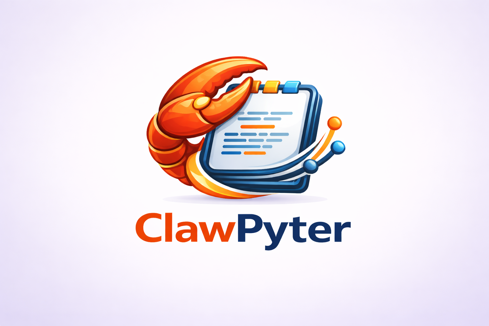

# ClawPyter

**ClawPyter** gives any AI agent direct access to JupyterLab. It enables Claude or any LLM to read, write, edit, and execute code in Jupyter notebooks — all in natural language, without manual interface interaction.

Two agents are supported:

| Agent | Plugin format | Install script |
|---|---|---|
| [OpenClaw](https://openclaw.ai) | TypeScript (`openclaw-plugin/dist/index.js`) | `./build4openclaw.sh` |
| [Hermes Agent](https://github.com/NousResearch/hermes-agent) | Python (`hermes-plugin/`) | `./build4hermes.sh` |



---

## What Can It Do?

ClawPyter exposes **36 tools** (33 core + 3 compatibility wrappers) that allow the AI to fully manage Jupyter notebooks:

**Server & File Operations:**
- Browse notebook files and filesystem structure
- Connect to different Jupyter server instances dynamically
- List running kernels and their status
- Inspect active connection settings

**Notebook Lifecycle:**
- Create new notebooks (with automatic name conflict resolution)
- Open (use) and close (unuse) notebooks
- Switch between active notebooks
- Restart notebook kernels
- List all active notebook sessions

**Cell Operations:**
- Read cell contents (brief or detailed format)
- Insert new code or Markdown cells
- Edit existing cell source code
- Delete one or multiple cells
- Execute individual cells with configurable timeout
- Run arbitrary code snippets directly in the kernel
- Insert and execute code cells in a single operation

**Execution Control:**
- Support for Jupyter magic commands (`%timeit`, `%pip install`, etc.)
- Shell command execution in the kernel (`!` commands)
- Configurable timeouts and streaming progress updates
- Capture and return execution outputs (text, HTML, images)

---

## When to use ClawPyter (and when **not** to)

ClawPyter is the **native Jupyter integration for Hermes Agent and OpenClaw**. Both runtimes load it as a plugin that ships alongside the agent, so tool dispatch lives **in the same process as the agent** — no extra MCP server to install, configure, keep running, or version-pin against the agent.

### Use ClawPyter if your agent runtime is one of these

| Runtime | Plugin form | What you get |
|---|---|---|
| **Hermes Agent** | `~/.hermes/plugins/clawpyter/` (Python) | 36 tools, Y.js CRDT co-editing, async `run_async=true` jobs |
| **OpenClaw** | `~/.openclaw/plugins/clawpyter/` (TypeScript) | Same 36 tools, TypeBox-typed SDK, contracts.tools manifest |

Both ship **the same 36 tools**, **the same notebooks**, **the same kernel pool**, and can be installed side by side on the same machine without conflicting with each other (Hermes uses Python, OpenClaw uses Node — they talk to the same JupyterLab instance at the socket level, not through ClawPyter).

### Don't use ClawPyter if your agent runtime is one of these

| Runtime | Use this instead |
|---|---|
| **GitHub Copilot** (VS Code / github.com) | [`jupyter-mcp-server`](https://github.com/datalayer/jupyter-mcp-server) — Datalayer's first-party MCP server. Has ClawHub distribution, pluggy extension hooks, 9+ sandbox backends (Colab, Kaggle, Modal, Daytona, …), and a JupyterLab embedded mode. |
| **Continue / Cline / Cursor / Aider** | [`jupyter-mcp-server`](https://github.com/datalayer/jupyter-mcp-server) — these runtimes speak MCP, not Hermes plugin or OpenClaw plugin. |
| **A Jupyter user with no agent** | The JupyterLab UI directly — ClawPyter adds nothing. |

### Why ClawPyter is **not** an MCP server

ClawPyter deliberately does **not** expose itself as an MCP server. We share the Jupyter tool **surface** with `jupyter-mcp-server` (both project their respective MCP clients / agents onto the JupyterLab REST + WebSocket endpoints), but the integration model is different on purpose:

- ClawPyter is **plugin-or-nothing** — it only makes sense inside an agent that already speaks the Hermes or OpenClaw plugin contract. Shipping an MCP shim would invite users from Copilot/Continue/Cline to install it for the wrong reasons, then blame either project when something doesn't work.
- `jupyter-mcp-server` is **MCP-or-everything** — it intentionally serves any MCP-capable client, including the editor / IDE agents listed above. That's its job; we don't compete on it.

If you're picking **one** Jupyter tool for a Hermes/OpenClaw deployment: **ClawPyter**.
If you're picking **one** for a Copilot/Continue/Cline deployment: **`jupyter-mcp-server`**.

---

## Architecture

```
User (in OpenClaw or Hermes chat)
        │
        ▼
  Agent Application
  (OpenClaw  ·or·  Hermes Agent)
        │
        ▼
  ClawPyter Plugin
  (openclaw-plugin/  ·or·  hermes-plugin/)
        │ ← Jupyter REST API + WebSocket
        ▼
  JupyterLab (local instance, port 8888)
        │
        ▼
  Your .ipynb notebooks & kernels
```

ClawPyter communicates directly with JupyterLab's REST API for file and session management, and uses WebSocket kernel channels for code execution. There is no intermediate MCP server.

**Co-editing with a live JupyterLab session.** When the optional
`jupyter-collaboration` server extension and the Hermes-side `jupyter_nbmodel_client`
package are installed, ClawPyter automatically routes notebook edits through the
shared Y.js CRDT document (`/api/collaboration/room/...`) instead of the Contents
API. A human reading the same notebook in their browser sees the agent's edits
appear live, and the agent sees the human's edits — no clobbering. If either
dependency is missing, ClawPyter silently falls back to the non-collaborative
read-modify-write path. Set `JUPYTER_COLLAB_MODE=off` to force the legacy path.

> **Note:** Live co-editing is currently implemented only in the **Hermes** plugin
> (`hermes-plugin/`). The OpenClaw plugin (`openclaw-plugin/`) still uses the
> Contents-API path; full two-way co-editing when `yjs` is installed.

**Key files:**
- `openclaw-plugin/src/index.ts` — TypeScript plugin. Registers all 36 tools with OpenClaw.
- **`openclaw-plugin/src/jupyter-client.ts`** — `JupyterDirectClient` class. REST API + WebSocket client (TypeScript).
- **`openclaw-plugin/skills/clawpyter/SKILL.md`** — Operating instructions for the AI (OpenClaw).
- **`hermes-plugin/`** — Python plugin for Hermes Agent (mirrors all 36 tools).
- **`hermes-plugin/SKILL.md`** — Operating instructions for the AI (Hermes).

---

## Prerequisites

**Common (both agents):**
- **JupyterLab** 4.x with a Python kernel
- **`jupyter-collaboration`** (server-side extension) and, on the agent side,
  **`jupyter_nbmodel_client`** + **`pycrdt`**. These are **required**, not
  optional: live human + agent co-editing is the point of ClawPyter, and
  without them every notebook silently degrades to whole-file
  read-modify-write (last writer wins).

`./conda-setup.sh` installs all of it in one step, and `./clawpyter.sh start -b native` refuses
to start a server that is missing the collaboration extension. The OpenClaw
plugin still uses the non-collaborative path regardless.

**For OpenClaw:**
- **OpenClaw** installed and running ([openclaw.ai](https://openclaw.ai))
- **Node.js** and **npm** ([nodejs.org](https://nodejs.org))

**For Hermes Agent:**
- **Hermes Agent** installed ([github.com/NousResearch/hermes-agent](https://github.com/NousResearch/hermes-agent))
- **Python 3.11+** with **pip**
- `httpx`, `websockets`, `jupyter_nbmodel_client`, `pycrdt` — all installed by
  `./conda-setup.sh` (and by `build4hermes.sh`)

---

## Installation

### Step 1 — Create the environment

```bash
./conda-setup.sh clawpyter          # add -r to recreate, -d for dev tooling
conda activate clawpyter
```

This installs both halves of the stack — the plugin runtime plus JupyterLab and
`jupyter-collaboration` — and its smoke test fails loudly if the collaboration
extension does not actually load. There are no opt-out flags: a partially
installed environment is the one failure mode that is invisible at runtime.

**Prefer Docker for the server?** Skip ahead to
[Running JupyterLab in Docker](#running-jupyterlab-in-docker); you still need
this environment for the agent-side plugin.

---

### Installing for OpenClaw

```bash
./build4openclaw.sh
```

`build4openclaw.sh` changes into `openclaw-plugin/`, installs npm dependencies, compiles `src/` to `dist/index.js`, uninstalls any previous version, and reinstalls the plugin into OpenClaw.

---

### Installing for Hermes Agent

```bash
./build4hermes.sh
```

`build4hermes.sh`:
1. Installs the required Python dependencies (`httpx`, `websockets`) via `pip`
2. Copies `hermes-plugin/` to `~/.hermes/plugins/clawpyter/`
3. Compile-checks all Python files
4. Reports registration status

The plugin is discovered by Hermes at startup. If Hermes is already running, restart it after installing.

**Configuration for Hermes** (set in your shell or a `.env` file):

| Variable | Default | Description |
|---|---|---|
| `JUPYTER_URL` | `http://127.0.0.1:8888` | Jupyter server URL |
| `JUPYTER_TOKEN` | _(empty)_ | Authentication token |
| `JUPYTER_TIMEOUT_MS` | `30000` | Request timeout in ms |
| `JUPYTER_DEFAULT_NOTEBOOK` | `Untitled` | Default notebook name for `jupyter_create_notebook` |
| `JUPYTER_COLLAB_MODE` | `auto` | `auto` (probe & prefer RTC), `on` (require RTC), or `off` (always REST) |

```bash
export JUPYTER_URL=http://127.0.0.1:8888
export JUPYTER_TOKEN=<token-from-clawpyter.sh>
```

Alternatively, paste the `Connect to Jupyter at …` line printed by `clawpyter.sh start` into the Hermes chat. The AI calls `jupyter_connect_to_jupyter` and all subsequent operations use that server.

### Step 2 — Start JupyterLab

Each time you want to use ClawPyter, start JupyterLab with the unified `clawpyter`
script. It manages **both** the native (`jupyter lab` on the host) and Docker
backends, and the lifecycle is recorded per-project at `<data_dir>/.clawpyter/instances.json`:

```bash
# Native: jupyter lab on the host, in your current conda env
./clawpyter start -b native -d ~/.openclaw/jupyter_home

# Docker: container from huangchtw/clawpyter:latest (auto-pull)
./clawpyter start -b docker -d ~/.openclaw/jupyter_home
```

**What it does:**
1. Resolves the port (default 8888; refuses if taken, suggests `-p <other>`)
2. Preflights: `jupyter` on PATH + `jupyter_server_ydoc` extension loaded (native only)
3. Uses the token from `-t`, generates a UUID by default, or `--no-token` for none
4. Starts the server in the background and waits for it to answer on the port (≤ 60 s)
5. Records the instance in `<data_dir>/.clawpyter/instances.json`
6. Prints the access URL and a ready-to-paste AI connect command

Multiple instances can run simultaneously — different `-p` ports, different `-d`
data dirs, or both backends in parallel. State is per-project (no shared
`/tmp/*.pid` files; no `~/.hermes/` coupling; works the same for Hermes, OpenClaw,
or pure human use).

**Output example:**
```
ClawPyter (native) running on port 8888 (PID 12345)
  URL:   http://127.0.0.1:8888/?token=a1b2c3d4-...
  AI:    Connect to Jupyter at http://127.0.0.1:8888 with token a1b2c3d4-...
  Log:   /home/you/.openclaw/jupyter_home/.clawpyter/8888.log
```

Copy the `Connect to Jupyter at …` line from the output and paste it into the
chat. The AI calls `jupyter_connect_to_jupyter` and is ready to work immediately
— no `openclaw.json` config or OpenClaw restart needed.

**Available flags:**
```
Usage: clawpyter start -d DIR -b {native,docker} [-p PORT] [-t TOKEN|--no-token]

  -d, --data-dir  DIR      Project dir whose notebooks Jupyter serves (required).
  -b, --backend   BACKEND  native | docker (required).
  -p, --port      PORT     Host port; default 8888.
  -t, --token     TOKEN    Auth token. Omit for auto-generated UUID; 'none' or
                           --no-token disables authentication.
      --no-token           Same as -t none.
```

Examples:
```bash
./clawpyter start -b native -d ~/.openclaw/jupyter_home           # auto-token on 8888
./clawpyter start -b docker -d ~/.openclaw/jupyter_home           # container, auto-token
./clawpyter start -b native -d ~/.openclaw/jupyter_home -p 8889   # explicit port
./clawpyter start -b native -d ~/.openclaw/jupyter_home --no-token # LAN-share mode
./clawpyter start -b docker -d ./notebooks -t mysecret123        # pinned token, container
```

### Step 3 — Stop JupyterLab

```bash
# Stop a specific (native | docker) instance tied to a project dir
./clawpyter stop -b native -d ~/.openclaw/jupyter_home
./clawpyter stop -b docker -d ~/.openclaw/jupyter_home
```

State file is updated atomically (write-temp-then-rename); a crashed previous
instance is detected and cleaned up on next `stop`.

**Other commands:**
```bash
./clawpyter status -d ~/.openclaw/jupyter_home                # show live instances
./clawpyter status -d ~/.openclaw/jupyter_home --all          # include stale
./clawpyter restart -b native -d ~/.openclaw/jupyter_home     # stop + start
./clawpyter logs -b native -d ~/.openclaw/jupyter_home        # tail the log
./clawpyter logs -b native -d ~/.openclaw/jupyter_home -f     # tail -f
```

The legacy scripts (`start-jpy.sh`, `stop-jpy.sh`, `clawpyter-docker-run.sh`)
are kept under `bak_old_scripts/` for reference; they still work but are no
longer developed. New users should use `./clawpyter`.

---

## Running JupyterLab in Docker

An alternative to the native backend — the image ships JupyterLab with
`jupyter-collaboration` already enabled, so co-editing works without touching
the host environment. Use the unified `clawpyter` script:

```bash
./docker-build-push.sh      # or: docker build -t huangchtw/clawpyter:latest .

./clawpyter start -b docker -d ~/notebooks            # auto-token, port 8888
./clawpyter start -b docker -d ~/notebooks -p 8899    # other port
```

`clawpyter` is the host-side wrapper (the same shape as `hplot`, `wsinsight`,
`sptxinsight` and friends). Behind the scenes it issues:

```bash
docker run -d --init \
    --label clawpyter.managed=1 \
    --name "clawpyter_<port>_<pid>" \
    -e HOST_UID -e HOST_GID \
    -p 8888:8888 \
    -v ~/notebooks:/workspace \
    huangchtw/clawpyter:latest
```

The mounted directory becomes `/workspace` inside the container and is
JupyterLab's root. The token (auto, fixed, or none) is recorded in
`<notebook_dir>/.clawpyter/instances.json` and printed in stdout.

Token handling:

| `-t` flag | Behaviour |
|---|---|
| not given | a UUID is auto-generated and recorded in state |
| `--no-token` | `JUPYTER_TOKEN=` empty string → JupyterLab disables auth |
| `-t <literal>` | pinned token |

To override the image (e.g. for forks):

```bash
CLAWPYTER_IMAGE=ghcr.io/myorg/clawpyter:dev ./clawpyter start -b docker -d ~/notebooks
CLAWPYTER_NO_PULL=1 ./clawpyter start -b docker -d ~/notebooks      # use local image as-is
```

**File ownership.** The container starts as root, remaps its built-in `user`
(uid 1000) to the owner of the mounted `/workspace`, then drops privileges —
so notebooks you create are owned by you, not root. Override with
`export HOST_UID=... HOST_GID=...` before running.

**Stop / view logs:**

```bash
./clawpyter stop    -b docker -d ~/notebooks       # docker stop + state cleanup
./clawpyter logs    -b docker -d ~/notebooks       # recent log lines
./clawpyter logs    -b docker -d ~/notebooks -f    # follow
```

The plugin is **not** in the image: it belongs in the agent's environment, not
on the notebook server. Install it with `./build4hermes.sh` as usual, then
point the agent at the URL+token printed by `clawpyter start`.

---

## Configuration

### OpenClaw

The `config` block in `~/.openclaw/openclaw.json` is **optional**. If it is not set, ClawPyter starts with defaults (`http://127.0.0.1:8888`, empty token) and you connect at runtime by telling the AI the URL and token.

If you want the connection to persist across OpenClaw restarts, set the `config` block manually under `plugins.entries.clawpyter` in `~/.openclaw/openclaw.json`.

| Option | Default | Description |
|---|---|---|
| `jupyterUrl` | `http://127.0.0.1:8888` | URL of the JupyterLab server |
| `jupyterToken` | _(empty)_ | Authentication token. Set automatically by `clawpyter.sh start`. |
| `notebookDir` | _(none)_ | Directory where notebooks are stored. Used for conflict detection. |
| `defaultNotebook` | _(none)_ | Default notebook name for `jupyter_create_notebook`. |
| `timeoutMs` | `30000` | Timeout in milliseconds for all Jupyter operations. |

**Example `openclaw.json` fragment:**
```json
"clawpyter": {
  "enabled": true,
  "config": {
    "jupyterUrl": "http://192.168.1.10:8888",
    "jupyterToken": "a1b2c3d4-e5f6-7890-abcd-ef1234567890",
    "notebookDir": "/home/user/.openclaw/jupyter_home"
  }
}
```

### Hermes Agent

Configuration is read from environment variables (see the table in [Installing for Hermes Agent](#installing-for-hermes-agent)). You can also set them in a `.env` file in your working directory. The connection can always be changed at runtime by telling Hermes: *"Connect to Jupyter at `<url>` with token `<token>`"*.

---

## Usage Examples

Once everything is running, chat with the AI in OpenClaw:

**Exploration:**
> "List my notebooks in the Jupyter home directory."
> "Show me all running kernels."

**Notebook Operations:**
> "Create a new notebook called `analysis.ipynb`."
> "Open the notebook `analysis.ipynb` and show me its cells."
> "List all notebooks I have open."

**Cell Edits:**
> "Insert a new code cell at the end that plots a histogram of the `age` column."
> "Replace cell 5 with a function that calculates the mean of column X."
> "Delete cells 10, 11, and 12."

**Execution:**
> "Run cell 3 and show me what it outputs."
> "Install pandas using pip."
> "Execute this snippet: `import pandas as pd; print(pd.__version__)`"

**Maintenance:**
> "Restart the notebook kernel."
> "Connect to the Jupyter server at `http://gpu-box:8888` with token `abc123`."

**Connect to any Jupyter server at runtime (no config needed):**

Just tell the AI the URL and token before doing anything else:
> "Connect to Jupyter at `http://192.168.1.100:8888` with token `abc123`, then list my notebooks."

The AI calls `jupyter_connect_to_jupyter` first. All subsequent operations go to that server. No `openclaw.json` config or OpenClaw restart is needed.

---

## Tool Reference

All 36 tools are prefixed with `jupyter_`. They work identically in both the OpenClaw (TypeScript) and Hermes Agent (Python) plugins. `jupyter_execute_code` and `jupyter_execute_cell` accept a `run_async=true` flag that returns a `job_id` immediately; pair that with `jupyter_get_job_result`, `jupyter_list_jobs`, and `jupyter_cancel_job` to drive long-running cells without blocking the agent session.

### Server Tools (4 tools)

#### `jupyter_list_files`
List files and directories on the Jupyter server.

| Parameter | Required | Default | Description |
|---|---|---|---|
| `path` | no | `""` (root) | Directory to list |
| `max_depth` | no | `1` | How many folder levels deep to search (max 3) |
| `start_index` | no | `0` | Pagination start position |
| `limit` | no | `25` | Max results to return. `0` = no limit. |
| `pattern` | no | — | Glob filter, e.g. `*.ipynb` |

Returns a tab-separated table: `Path`, `Type`, `Size`, `Last_Modified`

---

#### `jupyter_list_kernels`
List all running kernels on the Jupyter server.

No parameters. Returns a tab-separated table: `ID`, `Name`, `Display_Name`, `Language`, `State`, `Connections`, `Last_Activity`, `Environment`

---

#### `jupyter_connect_to_jupyter`
Switch ClawPyter to a different Jupyter server.

| Parameter | Required | Default | Description |
|---|---|---|---|
| `jupyter_url` | yes | — | Full URL of the Jupyter server, e.g. `http://localhost:8888` |
| `jupyter_token` | no | `""` | Authentication token |
| `provider` | no | — | Informational label only |

---

#### `jupyter_server_info`
Return the URL and token ClawPyter is currently using.

No parameters. Returns a JSON object:
```json
{
  "jupyter_url": "http://127.0.0.1:8888",
  "jupyter_token": "abc123..."
}
```

Use the returned values to build a notebook URL:
```
{jupyter_url}/lab/tree/{notebook_path}?token={jupyter_token}
```

---

### Notebook Tools (6 core tools + 3 compatibility wrappers)

#### `jupyter_create_notebook`
Create a new notebook file. Also starts a kernel session and activates the notebook automatically. After this call you do NOT need to call `jupyter_use_notebook`.

| Parameter | Required | Default | Description |
|---|---|---|---|
| `notebook_name` | no | `defaultNotebook` or `"Untitled"` | Filename for the new notebook. `.ipynb` is added automatically if missing. If the name already exists, a numbered suffix is appended (`-1`, `-2`, etc.). |

Returns a success message with the final filename and an authenticated access URL.

---

#### `jupyter_use_notebook`
Open an existing notebook and activate it as the current notebook for cell operations.

| Parameter | Required | Default | Description |
|---|---|---|---|
| `notebook_path` | yes | — | File path relative to Jupyter server root, e.g. `demo.ipynb` |
| `notebook_name` | yes | — | A label you choose to identify this notebook in ClawPyter. If unsure, use the same value as `notebook_path`. |
| `mode` | no | `"connect"` | `"connect"` to open an existing file; `"create"` to create the file first |
| `kernel_id` | no | — | Attach a specific kernel by ID. Server picks automatically if omitted. |

The tool activates the notebook and returns an overview of the first 20 cells.

**Guards:** If the notebook is already active, the tool returns immediately without reconnecting.

---

#### `jupyter_list_notebooks`
List all notebooks currently open in the ClawPyter session.

No parameters. Returns a tab-separated table: `Name`, `Path`, `Kernel_ID`, `Kernel_Status`, `Activate` (✓ = currently active)

---

#### `jupyter_restart_notebook`
Restart the kernel for an open notebook. Clears all kernel state and variables.

| Parameter | Required | Description |
|---|---|---|
| `notebook_name` | yes | The label from `jupyter_list_notebooks` |

---

#### `jupyter_unuse_notebook`
Close a notebook and delete its server session. The notebook file is not deleted.

| Parameter | Required | Description |
|---|---|---|
| `notebook_name` | yes | The label from `jupyter_list_notebooks` |

---

#### `jupyter_read_notebook`
Read the cell structure and content of an open notebook.

| Parameter | Required | Default | Description |
|---|---|---|---|
| `notebook_name` | yes | — | The label from `jupyter_list_notebooks` |
| `response_format` | no | `"brief"` | `"brief"` = first line + line count per cell. `"detailed"` = full source of each cell. |
| `start_index` | no | `0` | First cell to return (0-based) |
| `limit` | no | `20` | Number of cells to return. `0` = all. |

---

#### Compatibility wrappers
Three tools have a `_compat` variant that accepts either `notebook_name` or `notebook_path` (falls back to `notebook_path` if `notebook_name` is empty):

- `jupyter_restart_notebook_compat`
- `jupyter_unuse_notebook_compat`
- `jupyter_read_notebook_compat`

Use the `_compat` version only when you are unsure which argument to supply. Prefer the regular versions otherwise.

---

### Cell Tools (7 tools)

All cell tools require an active notebook. They operate on whichever notebook was most recently activated via `jupyter_use_notebook` or `jupyter_create_notebook`. All cell indices are **0-based** (the first cell is index `0`).

#### `jupyter_insert_cell`
Insert a new cell at a specific position.

| Parameter | Required | Description |
|---|---|---|
| `cell_index` | yes | Position to insert. Use `-1` to append at the end. |
| `cell_type` | yes | `"code"` or `"markdown"` |
| `cell_source` | yes | The cell content |

---

#### `jupyter_overwrite_cell_source`
Replace the full content of an existing cell. For code cells, also clears outputs and execution count.

| Parameter | Required | Description |
|---|---|---|
| `cell_index` | yes | 0-based index of the cell to replace |
| `cell_source` | yes | Complete new content |

Returns a diff showing removed (`-`) and added (`+`) lines.

---

#### `jupyter_execute_cell`
Run an existing code cell and save its outputs to the notebook file.

| Parameter | Required | Default | Description |
|---|---|---|---|
| `cell_index` | yes | — | 0-based index |
| `timeout` | no | `90` | Max seconds to wait |
| `stream` | no | `false` | Send progress updates while running |
| `progress_interval` | no | `5` | Seconds between progress updates |

Non-code cells return an error.

---

#### `jupyter_insert_execute_code_cell`
Insert a new code cell and immediately execute it. Use this instead of calling `jupyter_insert_cell` + `jupyter_execute_cell` separately.

| Parameter | Required | Default | Description |
|---|---|---|---|
| `cell_index` | yes | — | Position to insert. Use `-1` to append at the end. |
| `cell_source` | yes | — | The code to insert and run |
| `timeout` | no | `90` | Max seconds to wait |

---

#### `jupyter_read_cell`
Read the content and outputs of one cell.

| Parameter | Required | Default | Description |
|---|---|---|---|
| `cell_index` | yes | — | 0-based index |
| `include_outputs` | no | `true` | Include outputs for code cells |

---

#### `jupyter_delete_cell`
Delete one or more cells.

| Parameter | Required | Default | Description |
|---|---|---|---|
| `cell_indices` | yes | — | Array of 0-based indices, e.g. `[0, 2, 5]` |
| `include_source` | no | `true` | Return the deleted cell content |

The tool automatically processes indices from largest to smallest to prevent index shifting. You do not need to sort the indices.

---

#### `jupyter_execute_code`
Run code directly in the kernel without inserting it into the notebook. Output is returned but not saved.

| Parameter | Required | Default | Description |
|---|---|---|---|
| `code` | yes | — | Code to run |
| `timeout` | no | `30` | Max seconds to wait (maximum: 60) |

Use for: `%pip install`, `%timeit`, `!ls`, quick variable inspection.

Do NOT use for code that needs to be saved in the notebook — use `jupyter_insert_execute_code_cell` instead.

---

## Common Workflows

### Open an existing notebook and edit a cell

```
1. jupyter_list_files            → confirm the file exists
2. jupyter_use_notebook          → activate it (notebook_path + notebook_name)
3. jupyter_list_notebooks        → confirm activation
4. jupyter_read_notebook         → inspect cell structure (brief format)
5. jupyter_overwrite_cell_source → replace a cell
   or jupyter_insert_cell        → add a new cell
6. jupyter_execute_cell          → run the changed cell
```

### Create a new notebook and run code

```
1. jupyter_create_notebook           → creates file, starts kernel, activates notebook
2. jupyter_insert_execute_code_cell  → add code and run it in one step
```

### Switch between open notebooks

```
1. jupyter_list_notebooks  → see all open notebooks, find the target
2. jupyter_use_notebook    → activate the target notebook
```

### Install a package and verify it

```
1. jupyter_use_notebook  → activate any open notebook
2. jupyter_execute_code  → run %pip install pandas
3. jupyter_execute_code  → run import pandas; print(pandas.__version__)
```

---

## Troubleshooting

### AI gets a 403 Forbidden error

The token is missing or wrong. Two options:

- **Runtime fix (no restart):** Tell the AI: *"Connect to Jupyter at `http://<host>:8888` with token `<token>`"* — the AI calls `jupyter_connect_to_jupyter` and the correct token takes effect immediately. Works in both agents.
- **Persistent fix (OpenClaw):** Copy the token printed by `./clawpyter.sh` and update the `config.jupyterToken` field in `~/.openclaw/openclaw.json`, then restart OpenClaw.
- **Persistent fix (Hermes):** Set `JUPYTER_TOKEN=<token>` in your environment or `.env` file before starting Hermes.

### AI says "No active notebook"

You must activate a notebook before using any cell tool. Call `jupyter_use_notebook` (for an existing notebook) or `jupyter_create_notebook` (for a new one) before any cell operation.

### JupyterLab did not start

Check the log:
```bash
./clawpyter logs -b native -d <your-dir>          # or -b docker
```

Common causes: port already in use, the notebook directory does not exist, or
`jupyter-collaboration` is not installed in the active env (native only —
the preflight check is fatal; run `./conda-setup.sh <env>` to fix).

### Verify JupyterLab is running

```bash
./clawpyter status -d <your-dir>
```

Or via the API:
```bash
curl -s http://127.0.0.1:8888/api/status -H "Authorization: token YOUR_TOKEN"
```

### Restart a specific instance

```bash
./clawpyter restart -b native -d ~/.openclaw/jupyter_home
./clawpyter restart -b docker -d ~/.openclaw/jupyter_home
```

### Stop everything

```bash
./clawpyter stop -b native -d <each-dir-you-started>
./clawpyter stop -b docker -d <each-dir-you-started>
```

Or, for a quick sweep:
```bash
for d in ~/.openclaw/jupyter_home ~/work/notebooks; do
    ./clawpyter stop -b native -d "$d" 2>/dev/null
    ./clawpyter stop -b docker -d "$d" 2>/dev/null
done
```

### Restart everything (Hermes Agent)

```bash
# Stop any running clawpyter instances tied to the dirs you care about
./clawpyter stop -b native -d ~/.openclaw/jupyter_home
./clawpyter stop -b docker -d ~/.openclaw/jupyter_home

# Start fresh
./clawpyter start -b native -d ~/.openclaw/jupyter_home

# Re-install the plugin if the source changed, then restart Hermes
./build4hermes.sh
hermes               # Ctrl-C any existing session first to force a fresh start
```

---

## Project Structure

```
clawpyter/
├── hermes-plugin/                    # Python plugin for Hermes Agent
│   ├── plugin.yaml                   # Hermes manifest (name, version, provides_tools)
│   ├── __init__.py                   # register(ctx) — wires tools and installs skill
│   ├── schemas.py                    # OpenAI-format tool schemas for all 36 tools
│   ├── tools.py                      # Python Jupyter client (REST + WebSocket)
│   ├── collab_client.py              # Y.js CRDT client for live co-editing
│   └── SKILL.md                      # Skill file auto-installed to ~/.hermes/skills/clawpyter/
├── openclaw-plugin/                  # TypeScript plugin for OpenClaw
│   ├── openclaw.plugin.json          # OpenClaw plugin metadata and config schema
│   ├── skills/clawpyter/SKILL.md     # Skill file bundled with the OpenClaw plugin
│   ├── src/
│   │   ├── index.ts                  # Registers all 36 tools with OpenClaw
│   │   └── jupyter-client.ts         # JupyterDirectClient: REST API + WebSocket client
│   ├── package.json
│   └── tsconfig.json
├── docs/
│   └── _static/
│       └── clawpyter.png
├── conda-setup.sh                    # Create the conda env (plugin + JupyterLab + collab)
├── build4openclaw.sh                 # Build and install into OpenClaw
├── build4hermes.sh                   # Install Python plugin into Hermes Agent
├── clawpyter.sh                      # Unified lifecycle CLI (start/stop/restart/status/logs)
├── Dockerfile                        # JupyterLab server image, collaboration enabled
├── docker-entrypoint.sh              # IN-IMAGE: uid/gid remap; identical across siblings
├── docker-build-push.sh              # Build clawpyter:latest and push huangchtw/clawpyter
├── bak_old_scripts/                  # Legacy start-jpy.sh / stop-jpy.sh / clawpyter-docker-run.sh (reference only)
├── .dockerignore
├── ATTRIBUTIONS.md
└── README.md
```

> Note: `hermes-plugin/SKILL.md` and `openclaw-plugin/skills/clawpyter/SKILL.md`
> contain the same core operating instructions, duplicated because each agent's
> plugin packaging expects the skill file inside its own plugin directory. The
> only difference is the "Co-editing with a human" section, which appears only
> in the Hermes copy — live co-editing (Y.js CRDT) is a Hermes-only feature,
> while the OpenClaw plugin still uses the Contents-API path.

> Note: the legacy `start-jpy.sh`, `stop-jpy.sh`, and `clawpyter-docker-run.sh`
> scripts have moved to `bak_old_scripts/`. They still work but new users
> should use the unified `./clawpyter` entry point.
